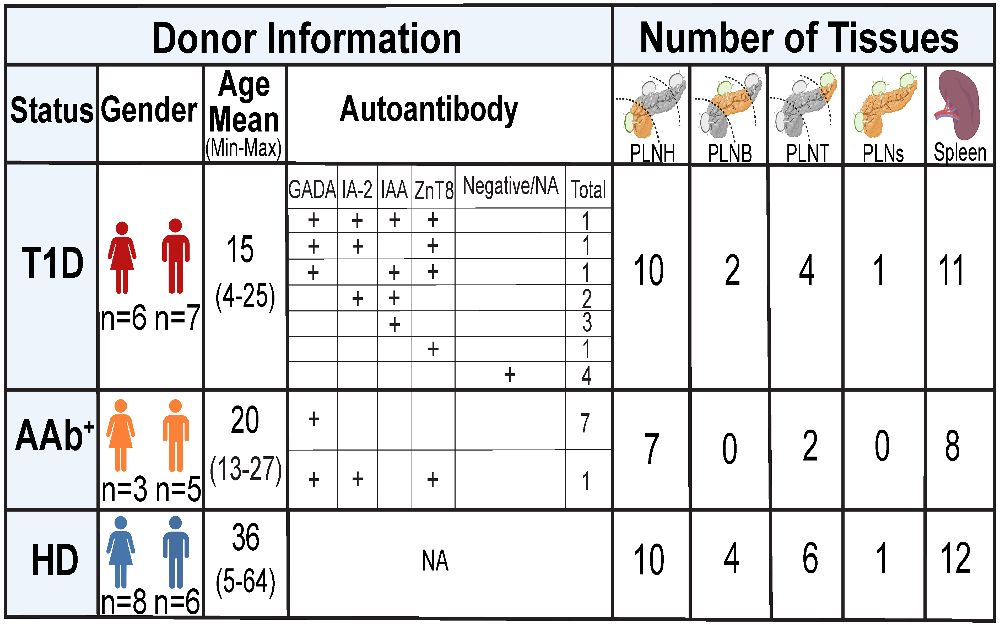

# Joint Profiling of Gene Expression and Chromatin Accessibility in Pancreatic Lymph Nodes and Spleens of Human Type 1 Diabetes
__Maryam Abedi*__, __Priyadarshini Rai*__, __Yeqiao Zhou*__, Chengyang Liu, Isabelle Johnson, Aditi Chandra, Maria Fasolino, Susan Rostami, Wei Wang, Zaw Min, Yanjing Li, Ming Yu, Atishay Jay, Vung Lian, Michael Silverman, Klaus H. Kaestner, Ali Naji, __Robert B. Faryabi#__, __Golnaz Vahedi#__  
 
\* Equal contributions 
\# co-corresponding authors 
 

## Overview
This repository contains the scripts used for data analysis and figure generation in the manuscript titled "*Joint Profiling of Gene Expression and Chromatin Accessibility in Pancreatic Lymph Nodes and Spleens of Human Type 1 Diabetes*". 
 
**Read the full manuscript [here](https://www.biorxiv.org/content/10.1101/2024.05.31.596885v1.abstract)**
 

## R version and packages
R 4.1.1 was used to perform the analysis.
 

## Data
The single-cell multiome data used in this study can be accessed from **[PANC-DB](https://hpap.pmacs.upenn.edu/)**.
 

## Interactive data analysis using CellXGene
| Link to CellXGene                                                                                                                                                      |
|:----------------------------------------------------------------------------------------------------------------------------------------------------------------------:|
| [Pancreatic lymph node immune cells](https://faryabi16.pmacs.upenn.edu/view/PLN_RNAAssay_SCT_V1_F.h5ad/)                                                               | 
| [Spleen immune cells](https://faryabi16.pmacs.upenn.edu/view/Spleen_RNAAssay_SCT.h5ad/)                                                                                | 
| [Sub-clustering of CD4 TCM and Treg cells from age-matched donors across different conditions](https://faryabi16.pmacs.upenn.edu/view/CD4TCMTregClust_SCT1Assay.h5ad/) |               
| [Sub-clustering of B non-naive cells from age-matched donors across different conditions](https://faryabi16.pmacs.upenn.edu/view/BintBmemClust_SCT1Assay.h5ad/)        |               
| [Mouse immune cells](https://faryabi16.pmacs.upenn.edu/view/Mouse_SCTAssay.h5ad/)                                                                                      |
 
              
## Human multiome analysis
Contains script(s) for quality control, normalization, cell type annotation, RNA–ATAC integration, and differential analysis of human data.
 

## Mouse multiome analysis
Contains script(s) for preprocessing and analysis of mouse single-cell multiome data, including quality control, normalization, cell type labeling, RNA–ATAC integration, and differential profiling.
 

## Image analysis
Contains script for quantifying microscopy images to complement single-cell analysis. 
*Link to PlugIn used for quantile normalization*: https://www.longair.net/edinburgh/imagej/quantile-normalization/
 

## Figures
Scripts for generating visualizations and plots used across different figures in the manuscript.
 

## Citation
Abedi, Maryam, et al. "Aberrant TNF signaling in pancreatic lymph nodes of patients with Type 1 Diabetes." *bioRxiv* (2024): 2024-05.
